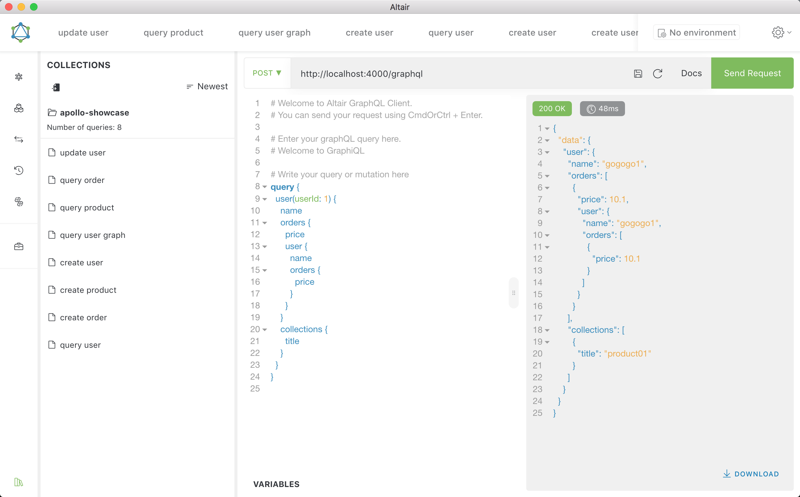

# GraphQL-Basedon-RESTful

Showcase about GraphQL server based on RESTful API server with focus on easy setup, performance and great developer experience. see [this article](https://zhuanlan.zhihu.com/p/78962152) for more information.

## Run

```bash
# install dependencies
yarn

# run koa server
npm run examples:koa

# run mock restful server
npm run start:json
```

*Tips: project does not have hot module reload, if you have modify the code, you need to rebuild it & db.json will be reset.

## Usage

**[Altair GraphQL Client](https://altair.sirmuel.design) is recommended for debugging.**

### Create user

```gql
mutation CreateUser($body: UserInput!) {
  createUser(body: $body) {
    name
  }
}
```

variables:

```json
{
  "body": {
    "name": "gogogo111",
    "orderId": 1,
    "productId": 1
  }
}
```


### Query user

```gql
query {
  user(userId: 1) {
    name
  }
}
```


### Query user graph

```gql
query userInfo($uid: Int!) {
  user(userId: $uid) {
    name
    orders {
      price
      user {
        name
      }
    }
    collections {
      id
      description
      users {
        name
      }
    }
  }
}
```

variables:

```json
{
  "uid": 1
}
```



## Refs

Thank you here!

- [GraphQL-BFF：微服务背景下的前后端数据交互方案](https://zhuanlan.zhihu.com/p/75241522)
- [第一届 GraphQLParty 首场工程实践图文版](https://zhuanlan.zhihu.com/p/38283930)
- [GraphQL Tools - Schema directives](https://www.apollographql.com/docs/graphql-tools/schema-directives/)
- [the-power-of-graphql-directives](https://callstack.com/blog/the-power-of-graphql-directives/)
- [GraphQL Tools - Mocking](https://www.apollographql.com/docs/graphql-tools/mocking/)

Welcome to commit issue and pull request!
